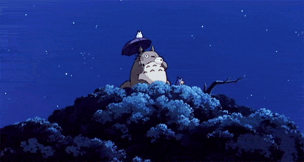

  
 <h1 align="center">⚙️ Gear-d-onion</h1> 
 <b>Hobby Developer · Godot Developer · Aspiring Game Designer</b> 
 
 <i>Learning things, building things, and figuring out what works along the way.</i> 
   <h2 align="center">🧠 A little about me</h2> 
 Hey! I'm <b>Gear-d-onion</b>. 
 
 I'm a hobby developer interested in <b>game development, game design and storytelling</b>. 
 
 I'm currently learning Godot and experimenting with different ideas, while trying to turn some of them into actual games. 
 
 I like understanding how things work, especially when I can eventually use that knowledge to build something myself. 
 
 I'm still figuring things out — but that's part of the fun. 
   <h2 align="center">🎮 Currently</h2> 
 🎮 Learning <b>Godot & GDScript</b> · 🧠 Improving my <b>game design</b> skills 
 
 ✍️ Exploring <b>storytelling</b> · 🛠️ Building and experimenting with small projects 
 
 🎹 Playing and learning <b>keyboard</b> · 🧊 Getting increasingly interested in <b>3D / CAD</b> 
   <h2 align="center">🎯 What I'm into</h2> 
 <b>Game Development</b> · <b>Game Design</b> · <b>Storytelling</b> · <b>Music</b> · <b>3D</b> · <b>Programming</b> 
 
 And probably a few other things I'll get distracted by eventually. 
   <h2 align="center">🕹️ Current Quest</h2> <h3 align="center"><code>Untitled Game</code></h3> 
 My future game. 
 
 Right now it's somewhere between an idea and an actual project. 
 <pre> STATUS Concept ████████░░░░░░░░ Prototype ░░░░░░░░░░░░░░░░ Development ░░░░░░░░░░░░░░░░ Release ░░░░░░░░░░░░░░░░ </pre> 
 <b>Status:</b> <code>COMING SOON™</code> 
 
 More details once there's something worth showing. 
   <h2 align="center">🛠️ Toolbox</h2> 
 <b>🎮 Game Development</b> 
 
 <code>Godot</code> · <code>GDScript</code> 
 
 <b>💻 Programming</b> 
 
 <code>Python</code> · <code>Java</code> 
 
 <b>🌐 Web</b> 
 
 <code>HTML</code> · <code>CSS</code> 
 
 <b>🔧 Other</b> 
 
 <code>Batch</code> · <code>Scratch</code> 
   <h2 align="center">🎯 Goals</h2> 
 <i>"Make games I'm actually proud of."</i> 
 
 🎮 Become a better game designer · 🎯 Finish my first game 
 
 💻 Improve my programming fundamentals · 🛠️ Learn by actually building things 
 
 🎮 Eventually become a game designer 
   <h2 align="center">📊 GitHub Stats</h2> 
 

 
  
   <h2 align="center">📫 Find me</h2> 
 <a href="[YOUR_DISCORD_LINK_HERE](https://discord.gg/z29ZxPS44k)"> 💬 <b>Discord</b> </a> 
   
 🧅 You found the onion. 
 <!-- Somewhere around here is probably a One Piece reference. If you found it, you found it. -->
